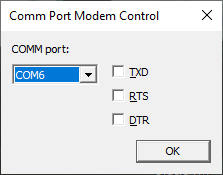

# CommControl
Set/Clear TXD/RTS/DTR on Windows COM port

This program opens a Windows COM port and presents 3 check boxes that control the following RS-232 lines on the COM port: TXD, RTS, DTR.

If all you want is an already-build X86 executable, here is the link: https://github.com/w5xd/CommControl/raw/master/CommControl-1.0.0.0.zip
